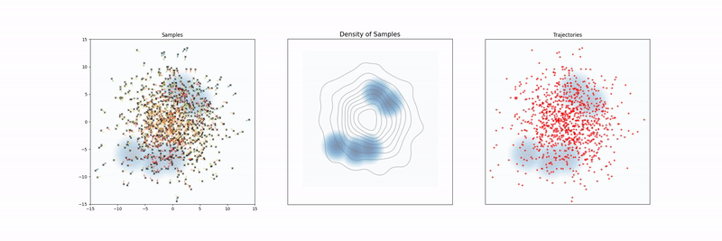
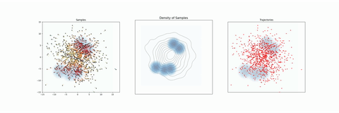
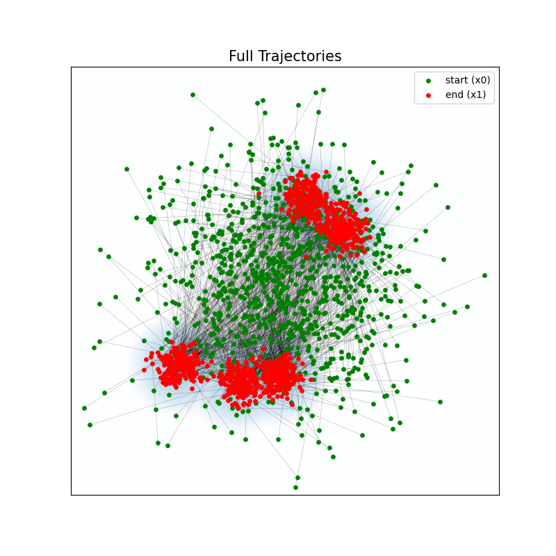
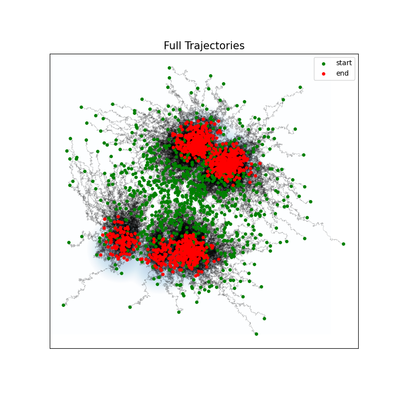
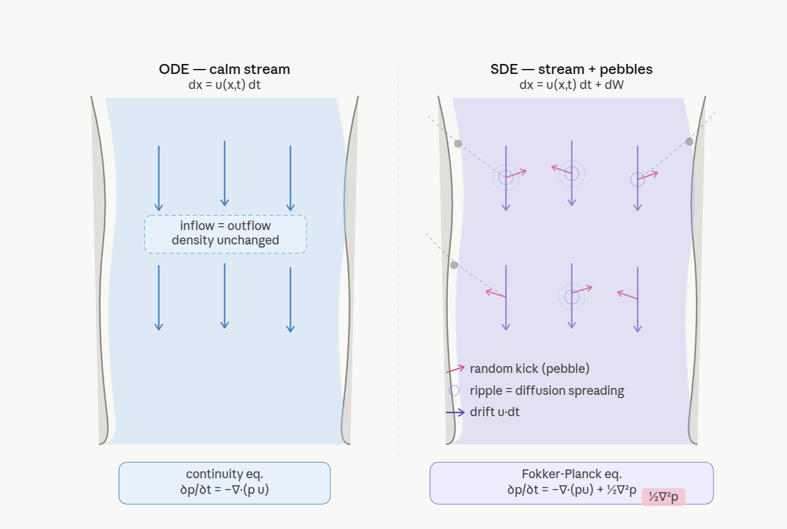

# SDE / ODE Sampling Dynamics

Implementations of two sampling algorithms - **Langevin dynamics** (SDE) and **flow matching** (ODE) - with animated visualizations of sample transport in 2D.

> I built this to wrap my head around the basics of flow matching and diffusion. The big idea: how do you move samples from a source distribution to a target distribution? Here, we conveniently *know* the target - which is great for understanding, but a total lie about real life. In practice, the target distribution is intractable and unknown. This is where all the complex math happens to derive a simple loss function.


## Project structure

```
sde_ode/
├── distributions.py      # Base classes and 2D distributions
├── dynamics.py           # ODE/SDE abstractions and Euler simulators
├── langevin.py           # Langevin SDE + animation
├── flow_matching.py      # Flow matching ODE + animation
└── outputs/              # Saved videos (.mp4) and figures (.png)
```

# ODE vs SDE - Side by Side Comparison

## Visualization Overview

The animations show the core problem: **steer samples from a source distribution to a target distribution**.

- **Blue** = the target distribution (our goal)
- **Initial points** = sampled from a standard Gaussian (the starting distribution)
- **Goal** = transport these initial samples to match the target distribution using either an ODE or SDE

## Dynamics


| | ODE | SDE |
|---|---|---|
| **Animation** |  |  |
| **Trajectories** |  |  |
| **Equation** | $dx_t = u_t(x)\ dt$ | $dx_t = u_t(x)\ dt + dW_t$ |
| **Noise** | None - deterministic | $dW_t$ - Brownian motion |
| **Path shape** | Smooth, straight | Curved, stochastic zigzag |

---

## Continuity Equation
### The core idea

At any point in a stream, probability is never created or destroyed.
What flows in must equal what flows out.

---

### ODE - the ideal stream

A perfectly calm river on a windless day.

Pick any patch of water. Water arriving from upstream
exactly equals water leaving downstream.
The current is the only thing moving particles - smooth, directed, predictable.


---

### SDE - the stream with rain

Same river, but now people are throwing pebbles into it.

The pebbles don't add any water - they just knock existing particles
sideways. A particle that was flowing smoothly downstream suddenly
gets nudged left, right, forward, back at every step.

Over time this jostling has one predictable effect: particles spread
outward. Dense clusters thin out.
Sparse regions fill in. Like a drop of ink slowly spreading through
still water - same amount of ink, just more evenly distributed.



| | ODE | SDE |
|---|---|---|
| **Equation** | $\dfrac{\partial p_t}{\partial t} = -\nabla \cdot (p_t\, u_t)$ | $\dfrac{\partial p_t}{\partial t} = -\nabla \cdot (p_t\, u_t) + \dfrac{1}{2}\nabla^2 p_t$ |
| **Extra term** | None | $\frac{1}{2}\nabla^2 p_t$ - diffusion spreads probability outward |
| **Meaning** | Probability is purely transported | Probability is transported **and** diffused |

---

## Equilibrium

| | ODE | SDE |
|---|---|---|
| **Condition** | $\nabla \cdot (p_t\, u_t) = 0$ | $\dfrac{\partial p^*}{\partial t} = 0$ |
| **Meaning** | Incompressible flow - flux has zero divergence | Distribution stops changing entirely |
| **Unique solution?** | No - many $u_t$ satisfy this | Yes - unique $u_t$ balances drift and diffusion |
| **Issue** | Multiple answers, no convergence guarantee | Converges to $p^*$ as $t \to \infty$ |

---

## Deriving $u_t$

### ODE - we design $u_t$ explicitly

Since equilibrium gives no unique answer, we **choose** a path directly.

**OT path:** pair $x_0 \sim p_0$ with $x_1 \sim p_1$, interpolate:

$$x_t = (1-t)\,x_0 + t\,x_1$$

Differentiate:

$$\boxed{u_t = x_1 - x_0}$$

Constant velocity, straight line, no ambiguity.

---

### SDE - $u_t$ is derived from equilibrium

Set $\partial p^* / \partial t = 0$ in the Fokker-Planck equation:

$$-\nabla \cdot (p_t\, u_t) + \frac{1}{2}\nabla^2 p_t = 0$$

Rearrange:

$$\nabla \cdot (p_t\, u_t) = \frac{1}{2}\nabla^2 p_t$$

Use the identity $\nabla p_t = p_t \nabla \log p_t$:

$$\frac{1}{2}\nabla^2 p_t
  = \frac{1}{2}\nabla \cdot (\nabla p_t)
  = \frac{1}{2}\nabla \cdot (p_t\, \nabla \log p_t)
  = \nabla \cdot \left(p_t \cdot \frac{1}{2}\nabla \log p_t\right)$$

Matching both sides:

$$\boxed{u_t = \frac{1}{2}\nabla \log p_t}$$

The drift must equal **half the score** of the target distribution.

---

## Sampling Algorithms

| | ODE | SDE |
|---|---|---|
| **Update rule** | $x_{t+dt} = x_t + u_t(x_t)\,dt$ | $x_{k+1} = x_k + \frac{\eta}{2}\nabla \log p^*(x_k) + \sqrt{\eta}\,\epsilon$ |
| **Noise at inference** | None | $\epsilon \sim \mathcal{N}(0,I)$ re-injected every step |
| **Example** | Flow Matching, DDIM | Langevin MCMC, DDPM |

---

## Key Insight

> **ODE:** No unique equilibrium - so we *design* $u_t$ (e.g. straight-line OT path).
> The continuity equation is satisfied by construction.
>
> **SDE:** The noise term $dW_t$ forces a unique stationary distribution $p^\*$.
> The only drift that balances it is $u_t = \frac{1}{2}\nabla \log p^*$ - the score.

---

## Final Boxed Results

$$\textbf{ODE (Flow Matching):} \quad u_t = x_1 - x_0$$

$$\textbf{SDE (Langevin):} \quad u_t = \frac{1}{2}\nabla \log p_t$$

---

## References

- [Diffusion Models (MIT 6.S184)](https://diffusion.csail.mit.edu/2026/index.html)
- [Flow With What You Know (ICLR 2025 Blog)](https://iclr-blogposts.github.io/2025/blog/flow-with-what-you-know/?ref=danmackinlay.name)
- Lots of chatting with Claude Code
